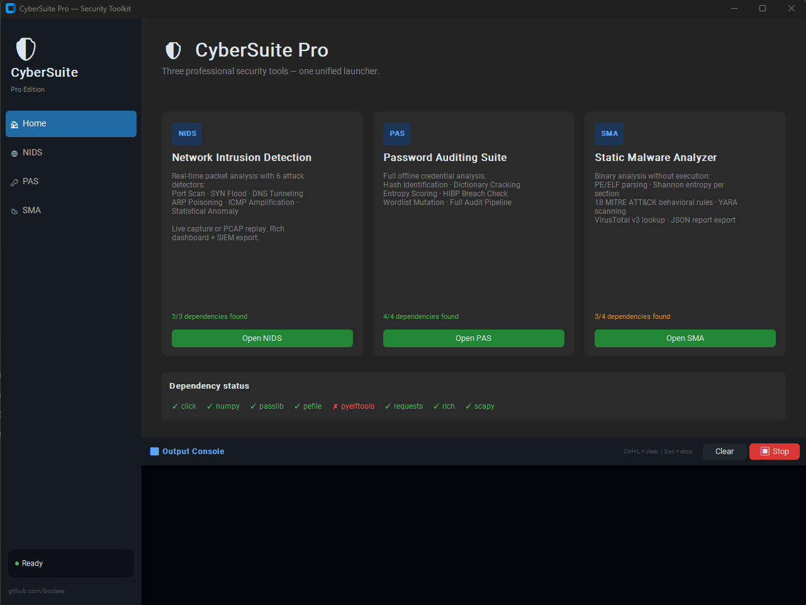

# CyberSuite Pro

**A unified GUI launcher for professional security tooling — and the desktop attack layer of a three-platform cybersecurity ecosystem.**

CyberSuite Pro integrates six security tools into a single dark-themed CustomTkinter application: Network Intrusion Detection, Password Auditing, Static Malware Analysis, Web App Testing, Payload Generation, and Custom Exploit Helper. A new **Recon Workspace** page connects the desktop app to a shared PostgreSQL backend, so recon results gathered in the web dashboard can be loaded directly into the attack tools with one click — or entered manually when offline.



**Web Dashboard:** [Online-Cyber-Dashboard](https://github.com/boclaes102-eng/Online-Cyber-dashboard) &nbsp;·&nbsp; **Backend API:** [Threat Intel Platform](https://github.com/boclaes102-eng/threat-intel-platform)

---

## What Makes This Special

Most GUI wrappers around CLI tools are shallow shims — they call `subprocess.run` and display stdout in a text box. CyberSuite does something more interesting: the tools run **in-process** in daemon threads, stdout is intercepted per-thread without touching the tool's source code, argparse-based tools have their `sys.argv` surgically replaced for the duration of the call, and the stop mechanism injects `KeyboardInterrupt` at the C level via `ctypes.PyThreadState_SetAsyncExc`.

The Recon Workspace is what makes this genuinely novel: it is the **desktop client** of a three-platform security pipeline, pulling recon data from a production PostgreSQL backend running on Railway and making it immediately available as pre-filled target inputs for the attack tools.

---

## Three-Platform Ecosystem

```
┌──────────────────────────────────────────────────────────────────────┐
│                  CyberOps Dashboard  (Next.js · Vercel)              │
│                                                                       │
│   Operator runs 50+ recon tools: IP lookup, subdomain enum,          │
│   SSL inspection, port scan, IOC enrichment, etc.                    │
│   ↓  clicks "Save to Workspace" on any result                        │
└───────────────────────────────┬──────────────────────────────────────┘
                                │ HTTPS · X-API-Key (server-side proxy)
                                ▼
┌──────────────────────────────────────────────────────────────────────┐
│              Threat Intel Platform  (Fastify · Railway)              │
│                                                                       │
│   recon_sessions table stores: tool · target · summary · full JSON   │
│   Also runs: CVE feed sync · IOC enrichment · asset monitoring       │
└───────────────────────────────┬──────────────────────────────────────┘
                                │ X-API-Key (from ~/.cybersuite/config.json)
                                ▼
┌──────────────────────────────────────────────────────────────────────┐
│              CyberSuite Pro  (this repo · Python · Windows)          │
│                                                                       │
│   Recon page → fetches sessions → one click → active target set      │
│   Target copied to clipboard → paste into WAT / PGN / CEH / NIDS    │
│   Offline fallback: manual target entry, no internet required        │
└──────────────────────────────────────────────────────────────────────┘
```

The config is stored at `~/.cybersuite/config.json` — API URL and key are set once, never hardcoded in source.

---

## Tools

| Page | Tool | What it does |
|---|---|---|
| **Recon** | Recon Workspace | Fetch saved dashboard recon sessions from the backend. Set active target with one click. Full offline fallback with manual input. Settings tab for API config. |
| **NIDS** | Network Intrusion Detection System | Real-time packet capture with 6 attack detectors: Port Scan, SYN Flood, DNS Tunneling, ARP Poisoning, ICMP Amplification, Statistical Anomaly. Live interface capture or PCAP replay. SIEM export. |
| **PAS** | Password Auditing Suite | Hash identification, offline cracking, entropy scoring, HIBP k-anonymity breach check, wordlist mutation, full audit pipeline. |
| **SMA** | Static Malware Analyzer | PE/ELF binary analysis without execution. Shannon entropy, 18 MITRE ATT&CK behavioral rules, YARA scanning, VirusTotal v3 lookup, JSON report. |
| **WAT** | Web App Tester | Web application security testing — target loaded from Recon Workspace. |
| **PGN** | Payload Generator | Reverse shells, bind shells, web shells, encoders, and TCP listener. 10+ languages. |
| **CEH** | Custom Exploit Helper | Custom exploit workflow tooling. |

---

## Architecture Decisions

### Tools run in-process, not as subprocesses

Each tool is loaded at runtime via `importlib.util.spec_from_file_location()` into the same Python interpreter — no child process, no subprocess pipes, no path juggling. The trade-off (a tool crash can affect the launcher) is mitigated by running every tool in a daemon `threading.Thread` with a `try/except` wrapper.

### Thread-aware stdout interceptor

All six tools print to `sys.stdout`. Rather than patching every `print()` call inside each tool, `launcher/utils/writer.py` wraps `sys.stdout` with a custom `_Writer` class that uses `threading.local()`. Each worker thread carries its own GUI callback; the main thread and all other threads fall through to the original stream untouched. **Zero changes were needed to any tool's source code.**

### `sys.argv` surgery for argparse tools

NIDS and SMA use `argparse`. The launcher saves `sys.argv`, replaces it with the constructed argument list, calls `mod.main()`, then restores `sys.argv` in a `finally` block. PAS uses Click — invoked programmatically via `mod.cli.main(args, standalone_mode=False)` with no `sys.argv` manipulation.

### Two-layer stop mechanism

Background threads are stopped by first setting a `stop_event` (cooperative — the tool checks it at checkpoints), then injecting `KeyboardInterrupt` via `ctypes.PyThreadState_SetAsyncExc` as a fallback (pre-emptive — works as long as the thread is in Python bytecode, not a blocking C call). This is why the NIDS "Interactive Menu" mode was removed: `input()` is a blocking C call that ignores the interrupt. The GUI surfaces all options as form fields instead.

### Recon Workspace — online/offline architecture

The Recon page makes a single `urllib.request` call to the backend with a 10-second timeout. If it fails for any reason (no internet, backend down, missing config), the Offline tab is always available and fully functional — the operator types the target manually. The config file (`~/.cybersuite/config.json`) is written by the Settings tab and read at fetch time, so credentials are never in source code.

### Headless test suite

The launcher's GUI classes are tested without a display by stubbing `customtkinter` in `sys.modules` before any import. Widget stubs must be real Python classes (not `MagicMock`) because page classes inherit from `ctk.CTkFrame` — `MagicMock`'s metaclass conflicts with normal class creation. 147 tests cover the thread runner, stdout interceptor, path resolution, every `_build_argv` mode/flag combination, tag classification, and integration smoke tests.

---

## Quick Start

Requires **Python 3.11+** on PATH.

```bat
setup.bat          # create .venv + install dependencies (first run only)
run.bat            # launch the GUI
```

### Build a standalone `.exe`

```bat
.venv\Scripts\activate
python build.py
# → dist/CyberSuite.exe   (portable, no Python needed on target machine)
```

---

## Keyboard Shortcuts

| Shortcut | Action |
|---|---|
| `Ctrl+L` | Clear output console |
| `Escape` | Stop the running tool |

---

## Connecting to the Backend

On first launch, go to **Recon → Settings** and enter:

| Field | Value |
|---|---|
| Backend API URL | Your Railway deployment URL |
| API Key | The `tip_…` key from the Threat Intel Platform |

Settings are saved to `~/.cybersuite/config.json`. After saving, click **Fetch Sessions** in the Workspace tab to load your saved dashboard recon runs.

If the backend is unreachable, switch to the **Manual (Offline)** tab and enter the target directly.

---

## Project Structure

```
CyberSuite/
├── launcher/
│   ├── main.py                   Entry point
│   ├── app.py                    Main window (sidebar, console, nav)
│   ├── pages/
│   │   ├── home_page.py          Dashboard overview
│   │   ├── recon_page.py         ← new: Recon Workspace (online + offline)
│   │   ├── nids_page.py          Network Intrusion Detection
│   │   ├── pas_page.py           Password Auditing Suite
│   │   ├── sma_page.py           Static Malware Analyzer
│   │   ├── wat_page.py           Web App Tester
│   │   ├── pgn_page.py           Payload Generator
│   │   └── ceh_page.py           Custom Exploit Helper
│   └── utils/
│       ├── runner.py             Thread runner + two-layer stop mechanism
│       ├── writer.py             Thread-aware stdout interceptor
│       └── paths.py              Tool directory resolution
├── Network-Intrusion-Detection-System/
├── Password-Auditing-Suite/
├── Static-Malware-Analyzer/
├── Web-App-Tester/
├── Payload-Generator/
├── Custom-Exploit-Helper/
├── tests/                        147 pytest tests (headless)
├── assets/                       Screenshots
├── requirements_launcher.txt
├── setup.bat
├── run.bat
└── build.py
```

---

## Notes

- **Live NIDS capture** requires [Npcap](https://npcap.com/) on Windows or `cap_net_raw` capability on Linux.
- **VirusTotal lookups** (SMA) require a free API key from virustotal.com — set as `VT_API_KEY` env var or paste in the SMA page.
- `yara-python` is optional — SMA gracefully skips YARA scanning if not installed.
- The Recon Workspace works fully offline — backend connectivity is tested at fetch time with a 10-second timeout, not at startup.

---

## License

[MIT](LICENSE)
